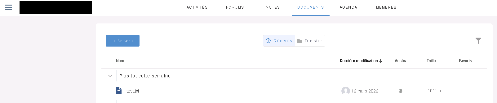
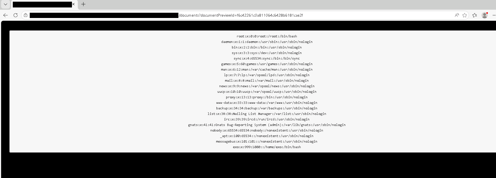

# eXo-Platform - Arbitrary-File-Read

The eXo Platform CMS is vulnerable to an arbitrary file read as an authenticated user, by abusing the zip import functionality in the "Drive" module.

## POC

eXo CMS offers a drive module, which allow an authenticated user to import and extract a zip file. However, the module will try to resolve any symbolic link to a readable file while extracting the archive. By crafting a malicious zip file, which contains a symbolic link, a malicious user can retrieve the targeted file content, which will be also uploaded to the drive share.

 
 

**Crafting zip file**
 

 
 
 
 

**Resolved /etc/passwd**
 

 
 
 
 

